# CN ORANGE PROBLEM

# Link Failure Detection and Recovery

Name : Sharanya R

SRN: PES1UG24CS902

Class: 4th Sem, Section A

## PROBLEM STATEMENT –

Detect link failures and update routing dynamically – In a computer network, when a
link between two devices fails, the traffic attempts to transmit through the failed link,
thus causing packet loss.

To prevent this, the traffic should be distributed dynamically to other working links to
ensure that the data reaches the destination without packet loss.

The objective is to create an SDN based solution which

- Monitors topology changes in real time
- Detects link failure in the automatically
- Updates flow rules dynamically to reroute the traffic
- Restores connectivity without manual intervention

There are two topologies used here –
* LINEAR – this is a simple topology with one link between the switches to
demonstrate how the traffic flows between the hosts when there is a path. This
has no alternate path, hence when the link between the switches s1 and s2 is
down, the packets are lost.

* TRIANGULAR – this topology has 3 switches – s1,s2,s3. Host h1 has a link to s1, and
host h3 has a link to s3. The switches are interconnected with each other to form
a triangle. When one link is down, the traffic is rerouted through other links, and
the pingall is a success. A triangular topology provides multiple independent
paths between any two nodes, enabling fault tolerance. This topology is the
simplest to demonstrate rerouting, and hence was chosen. The graph contains a
cycle, so, removing one edge does NOT disconnect the graph – there is always an
alternate path between nodes.

## SETUP STEPS –

- Install mininet using
  ```
    sudo apt update
    sudo apt upgrade -y
    sudo apt install mininet -y
  ```
- Install ryu using
  ```
    pip install ryu
  ```
    OR
    Run the following commands:
  ```
    sudo apt update
    sudo apt install -y git python3 python3-pip python3-dev
    git clone https://github.com/faucetsdn/ryu.git
    cd ryu
    pip3 install -e.
  ```
- Cd into the directory with the codes
- In one terminal, start the ryu controller. This should remain running in the background
   ```
    ryu-manager controller.py
   ```
- In another terminal, open the mininet cli using the command
  ```
  sudo python3 topology.py
  ```
- Enter the commands in the mininet cli


## PROOF OF EXECUTION –

**LINEAR TOPOLOGY**
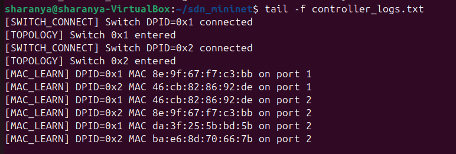

Controller output, shows how the paths are being learnt

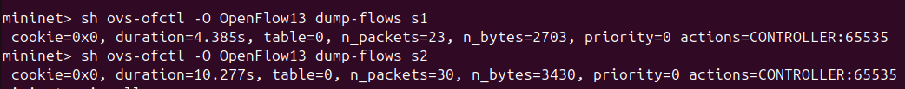
In the very beginning, the flow rules have not been installed in the switches, hence
packets of the new flow are sent to the controller via Packet-In messages.

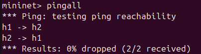

When we do pingall, we can see that all the packets have transmitted successfully,
showing that the link is working well.

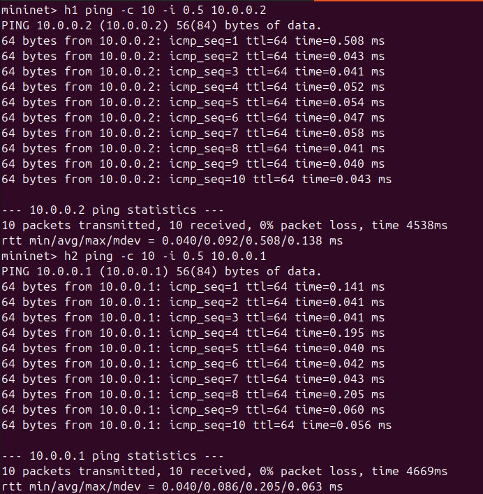

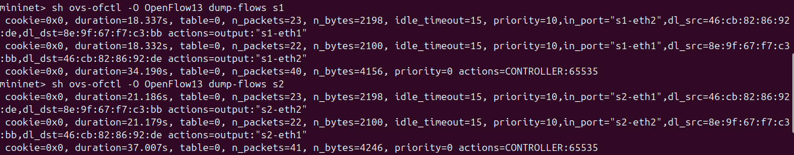

After the ping has been performed, we can see that the switches learn the flow rules,
and the full flow table is displayed.

IPERF output
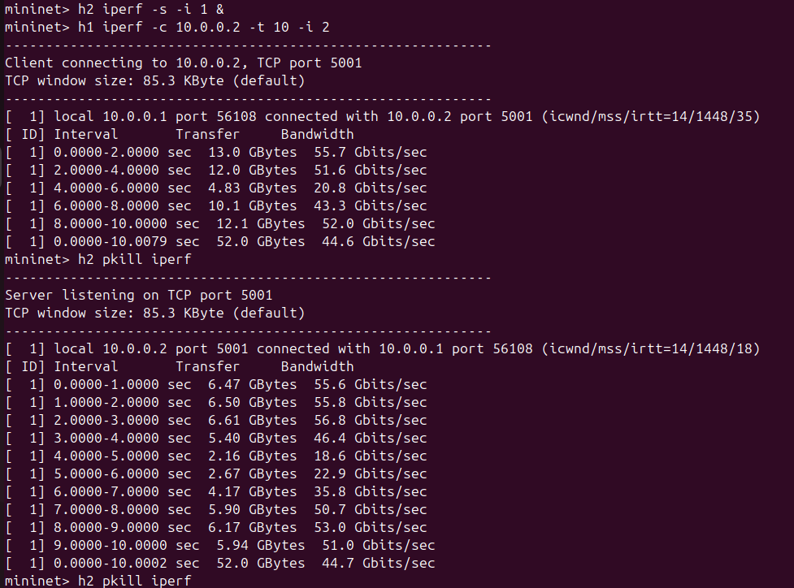

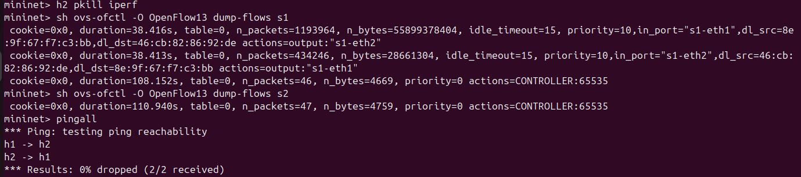

We can observe that the number of packets in the flow table has increased drastically,
because the iperf generates high throughput TCP traffic, resulting in a large number of
data packets and ACK packets, which rapidly increases flow counters

Now, when the link is down, we can see that the packets dropped (100%). Only when
the link is restored, the packets can be sent. This is because there is no alternate path
through which the packets can be rerouted, hence no new flow rule can be installed for
a non-existent link.

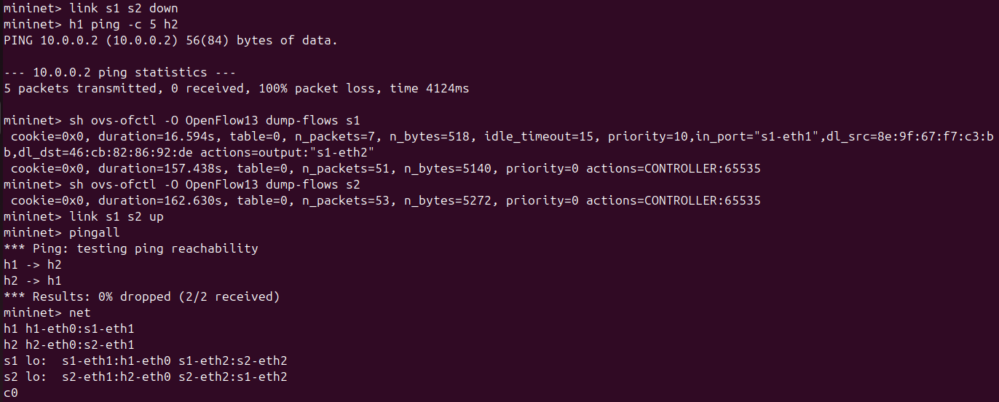

This is the wireshark output-

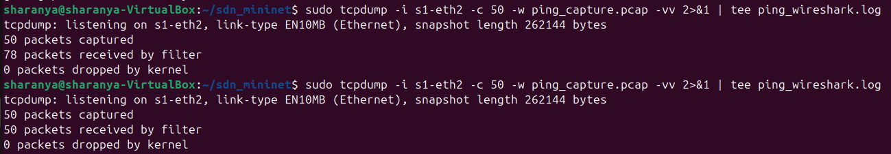

**TRIANGULAR TOPOLOGY**
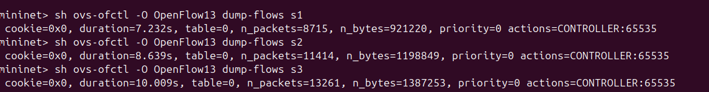

Flow table has no installed rules.


Ping output -

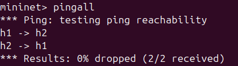

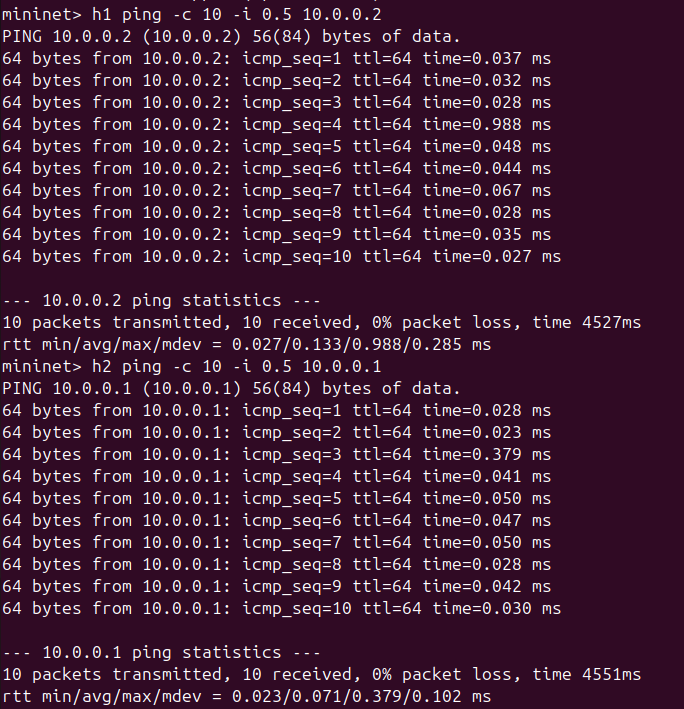

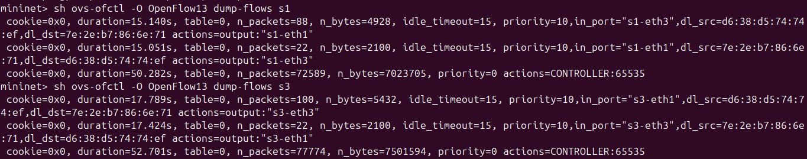

Rules have been installed in the flow table.

IPERF Results –

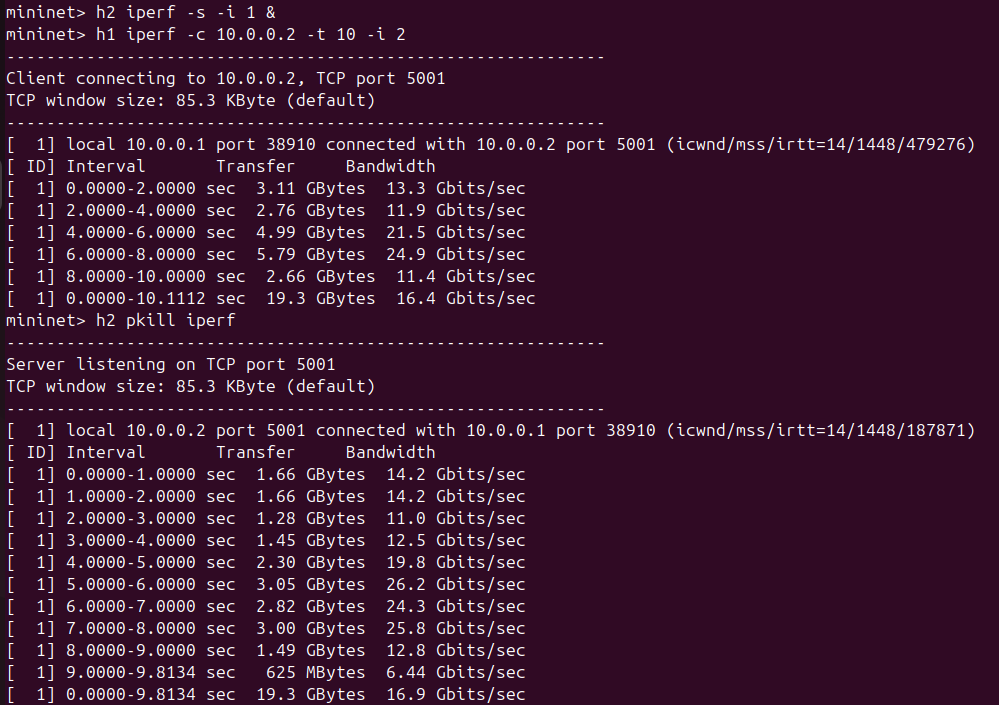

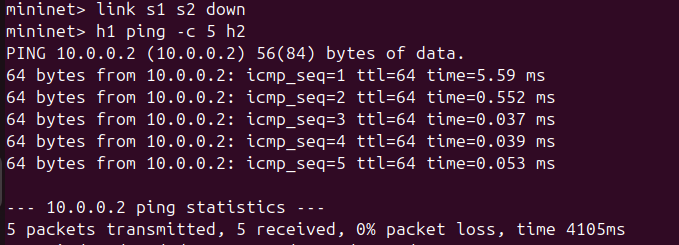

Now, link s1 s2 is down. So, packets are rerouted via link s1 s3, and still reach the
destination successfully, hence ping shows 0% packet loss. Thus link failure is detected
automatically, flow rules are updated dynamically and connectivity is restored.

- RYU topology module detects link removal, which is automatically triggered
    when a link goes down.
- The controller removes the link from the active topology, marks the ports as
    failed, and triggers recovery.


- Recovery mechanism – Flow rules are cleared, but not the MAC table entries,
    because the destination needs to be known. Then, the forwarding decision is
    taken.
- Alternate routing takes place – the destination switch is marked, and the shortest
    path is computed using dijkstra's algorithm, and the next hop port is returned.
- EventLinkAdd is used for link restoration – when a link becomes up, it is added to
    the active_links, and removed from down_links. The flows are updated implicitly
    on next packet. This is an event-driven mechanism.

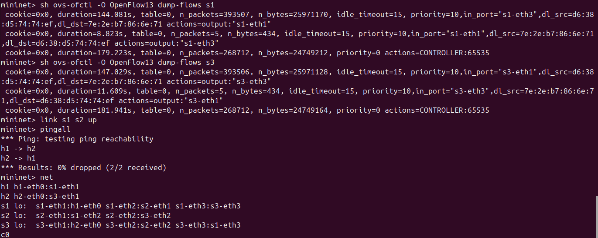

WIRESHARK output –

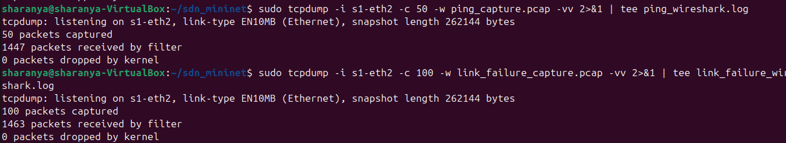
